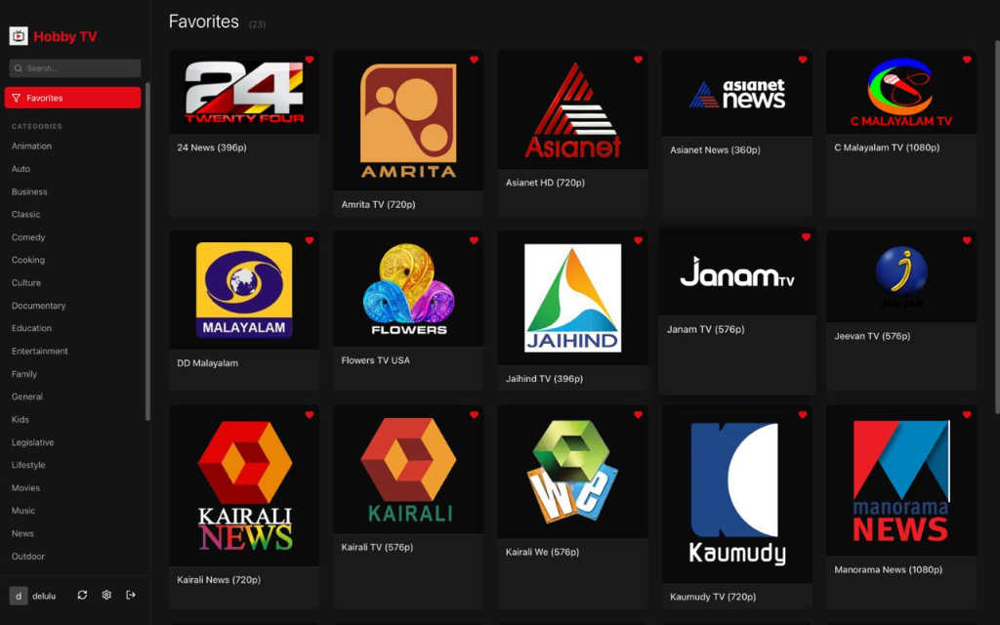
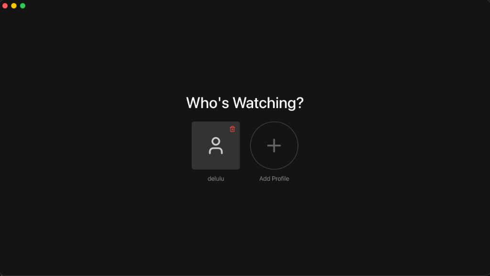
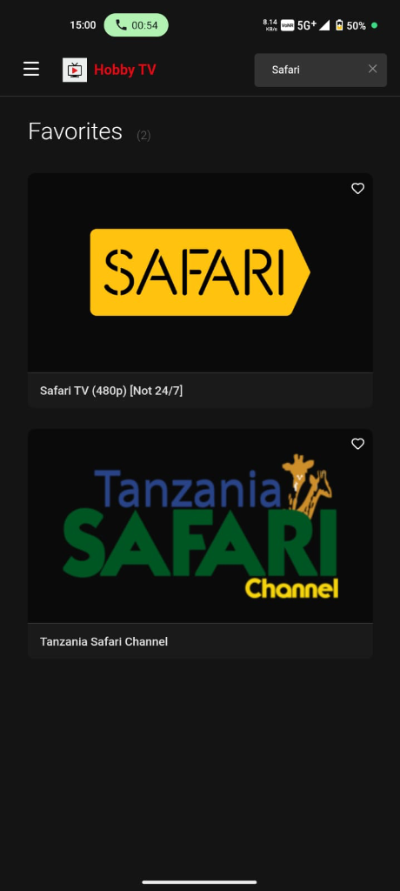
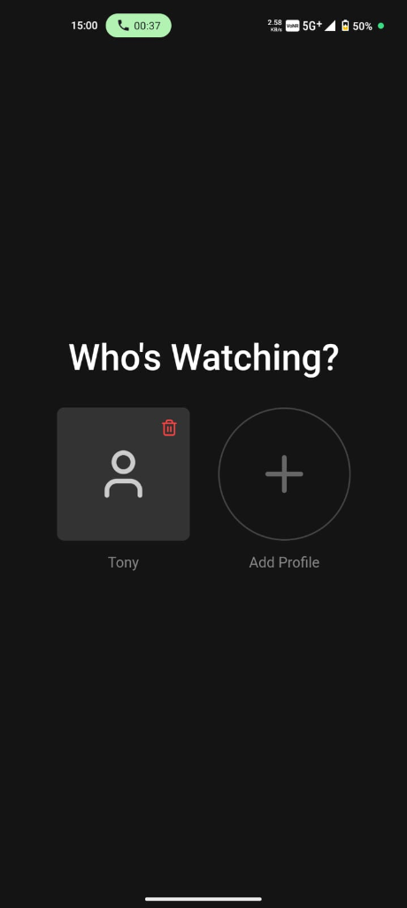

# Hobby TV

A modern, cross-platform IPTV player built with React, TypeScript, Vite, Electron, and Capacitor.

## Screenshots

### Desktop
| Dashboard | Profiles |
|:---:|:---:|
|  |  |

### Mobile
| Dashboard | Profiles |
|:---:|:---:|
|  |  |

## Features

- **Cross-Platform**: Runs on macOS, Windows, Linux, and Android.
- **Multi-Profile Support**: Create separate profiles for different users with individual settings.
- **Favorites System**: customizable favorites list per profile.
- **Smart Filtering**: Filter channels by category and language.
- **Search**: Fast, responsive search for channels.
- **Modern UI**: Clean, dark-themed interface with responsive design.

## Building

To build the application for different platforms:

### Desktop (Electron)
Artifacts will be in `dist-electron-builder/`:
- **Windows**: `npm run build:win` (Requires Wine on macOS/Linux for .exe)
- **Linux**: `npm run build:linux` (Produces .AppImage, .snap, .deb)
- **Mac**: `npm run build:mac` (Produces .dmg)

### Android (Capacitor)
1. Run `npm run build:android` to build the web app and sync it to the Android project.
2. Open Android Studio: `npx cap open android`.
3. Build/Run the APK from Android Studio.
